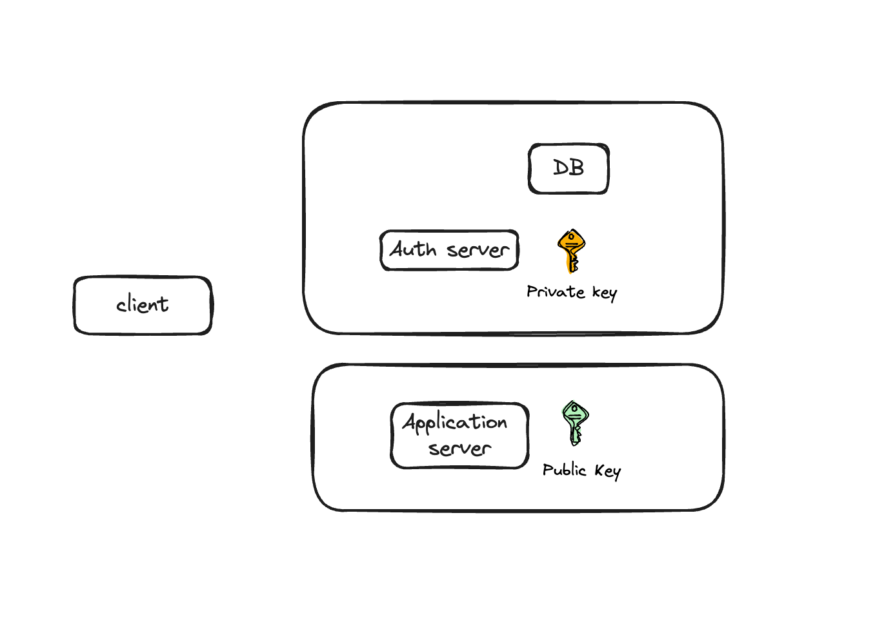

# JWT-lab

By end of this lab, you will learn 3 things

- how to create a JWT as an authorization server
- How to verify a JWT as an application server
- How client passes JWT from authorization to application server

Apart from this you’ll learn

- How to run full stack application with React framework in frontend and Express server in backend.
- How client and server communicates and pass authorization details.

# Article
Link to article
https://medium.com/@thakkarsmit/how-jwt-enables-password-less-authentication-870ada4f1e45

# Architecture


# Setup
Install **Node.js**

# Steps
1. Implement function in `helper.js` that encodes string to base64, and function that decodes it.

1. Create private and public keys using RSA algorithm. Store it in `keys` folder. Use `openssl genpkey`

1. Implement function in `helper.js` that creates a digital signature of a data.

1. Implement function in `helper.js` that verifies digital signature.

1. Implement function in `auth-server/app.js` that creates a JWT. 

1. Implement function in `application-server/app.js` that verifies a JWT. 

1. Implement function in `application-server/app.js` that decodes user information from JWT.

# How to run

```
cd client
npm start
```
This will run client on port XXXX

```
cd server/auth-server
node app.js
```
This will run an auth server on port 3001

```
cd server/application-server
node app.js
```
This will run an application server on port 3002
